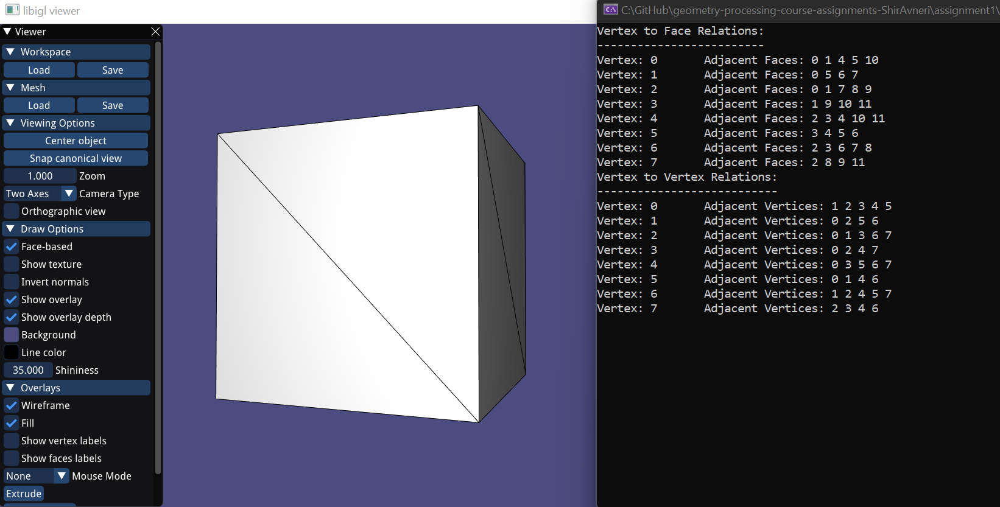
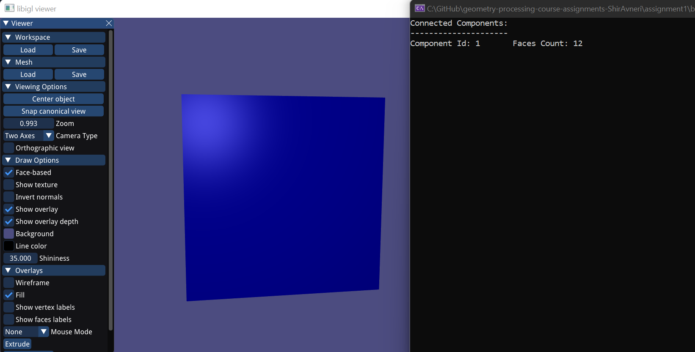
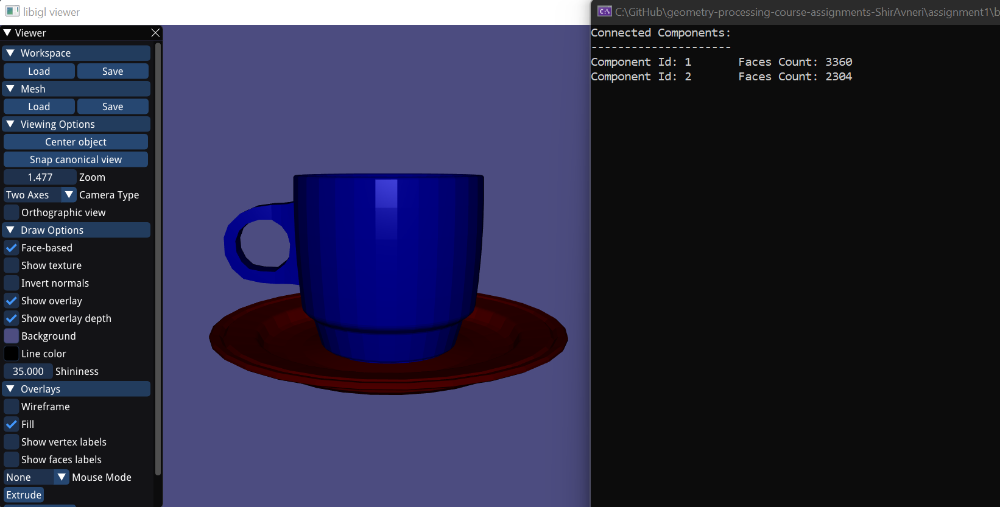
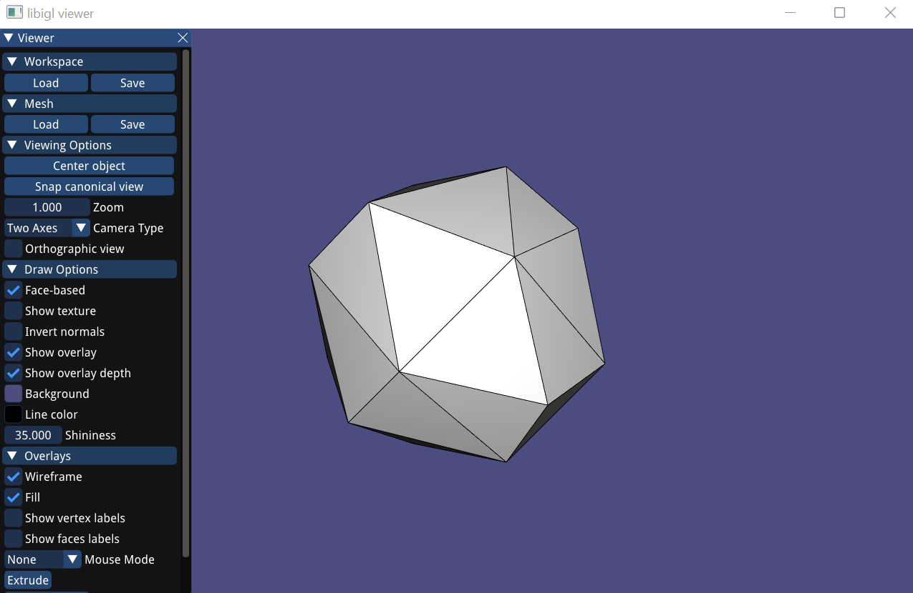
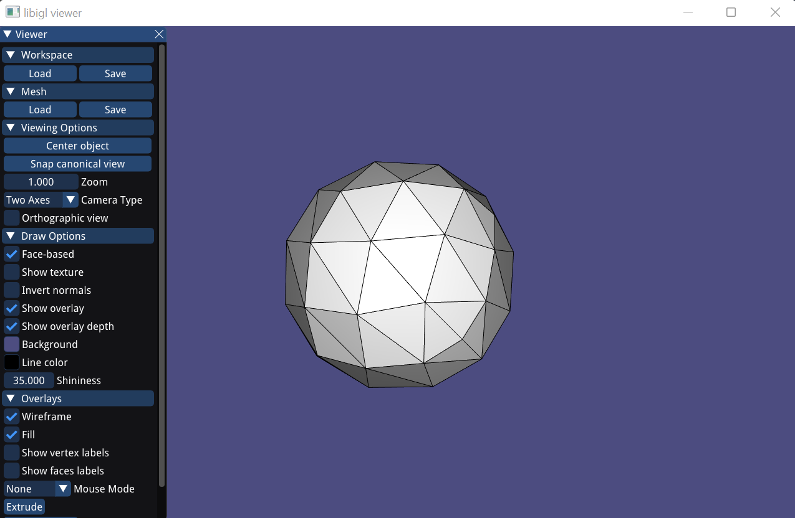
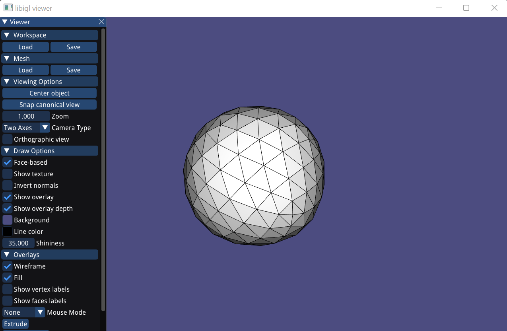
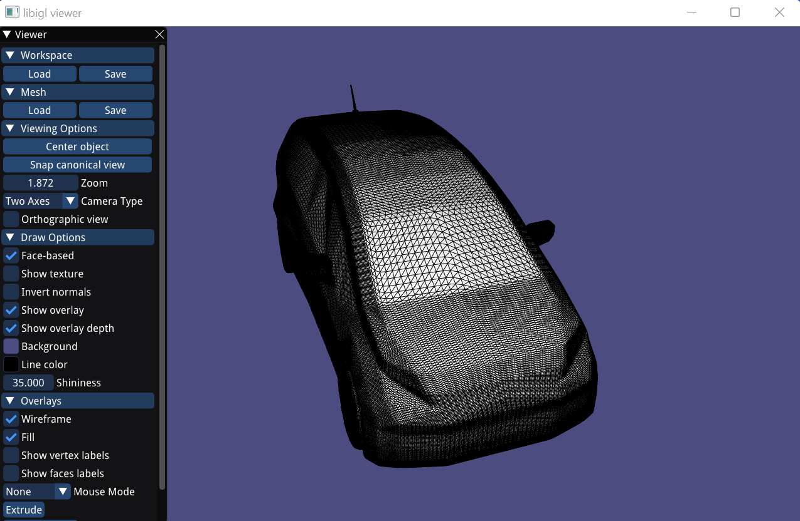
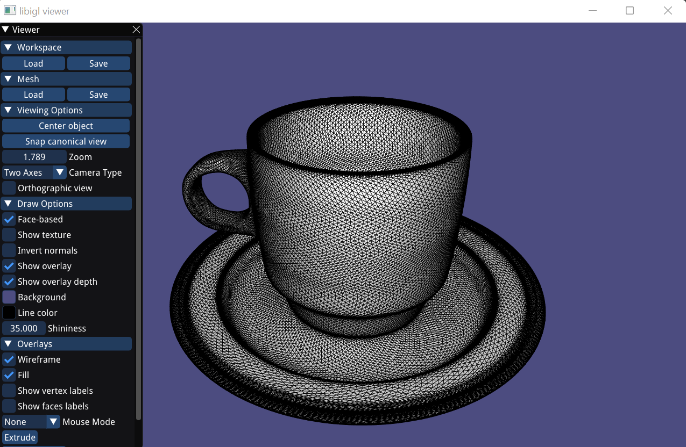
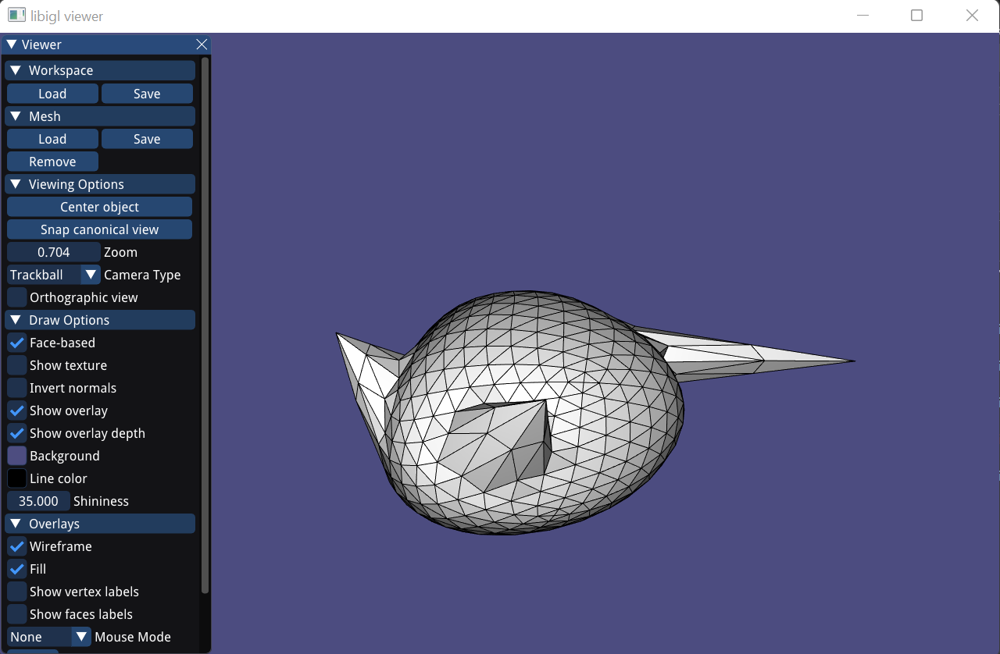

# Assignment 1

## Required results

### Tasks
1) Add a text dump of the content of the two data structures for the provided mesh “cube.off”.
  
  
  
2) Show screenshots of the provided meshes with each connected component colored differently.   
   Show the number of connected components and the size of each component (measured in number of faces) for all the provided models.  
   
  
    
  
   
  

3) Show screenshots of the subdivided meshes.

### One Time Subdivided Cube  
  
  
### Two Times Subdivided Cube  
  
  
### Three Times Subdivided Cube  
  
   
### Two Times Subdivided Honda  
  
  
### Three Time Subdivided Cup  
  

4) Show screenshots of face extrusion.  
**Not implemented.**  

5) Show a screenshot of a mesh you designed yourself starting from 'cube.off' and using the GUI supplied editing operations, as well as sqrt3 subdivision and face extrusion. Make sure to also save the mesh under the name 'design.off', commit and push it.  
    
After many unsuccessful attempts to design a mesh that makes sense, I was able to create a mesh that resembles a mouse.    
    
  
