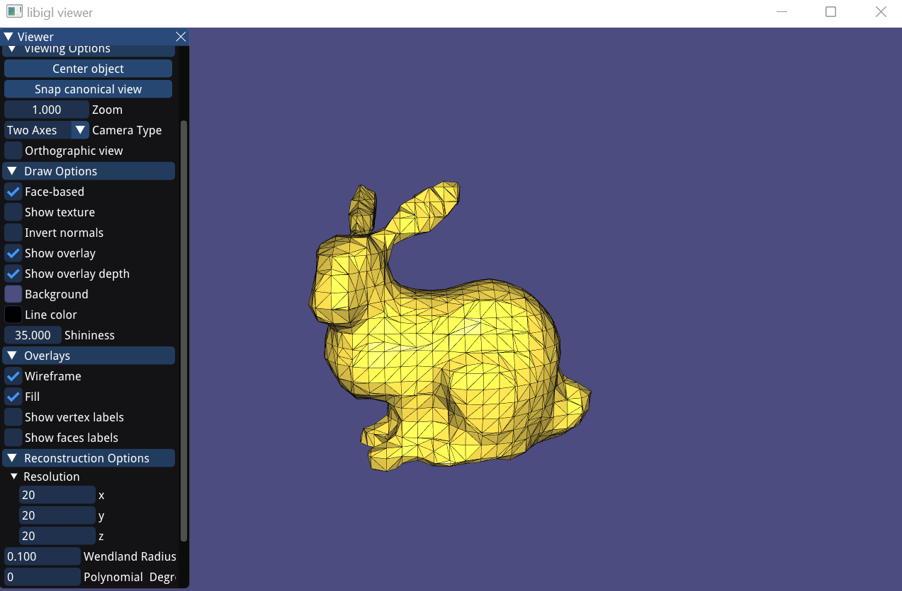

# Assignment 2
  
## Required results

### Mandatory Tasks
1) Show the visualization of the constrained points for the 'cat.off' point cloud.  
  
  

2) Show screenshots of the grid with nodes colored according to their implicit function values (cat.off and luigi.off).  
#### cat.off
  
#### luigi.off
  

3) Show screenshots of the reconstructed surfaces. Experiment with different parameter settings: grid resolution (also anisotropic in the 3 axes), Wendland function radius, polynomial degree. Add all these settings to the GUI to ease experimentation. Briefly summarize your observations and save the reconstructed models in the off format for every point-cloud dataset provided (assignment2/results).
### Key Observations  
* Resolution - the higher the resolution, the better the reconstructed models. However, if it is not uniform, the models twitch.
* Wendland Radius - a high Wendland Radius can lead to parts of the model disappearing, and a low one can lead to holes and distortion in the model.
* Polynomial Degrees - 1 and 2 are likely to produce artifacts around the model.

### Experimenting with the Cat Model  
#### Resolution: 10x10x10, Wendland Radius: 0.100, Polynomial Degree: 0  
  
#### Resolution: 20x20x20, Wendland Radius: 0.100, Polynomial Degree: 0  
  
#### Resolution: 30x30x30, Wendland Radius: 0.100, Polynomial Degree: 0  
  
#### Resolution: 20x20x20, Wendland Radius: 0.200, Polynomial Degree: 0  
  
#### Resolution: 20x20x20, Wendland Radius: 0.050, Polynomial Degree: 0  
  
#### Resolution: 20x20x20, Wendland Radius: 0.100, Polynomial Degree: 1  
  
#### Resolution: 20x20x20, Wendland Radius: 0.100, Polynomial Degree: 2  
  
#### Resolution: 25x20x20, Wendland Radius: 0.100, Polynomial Degree: 0  
  

### Experimenting with Other Models  
#### Resolution: 20x20x20, Wendland Radius: 0.100, Polynomial Degree: 0  
  
#### Resolution: 37x37x37, Wendland Radius: 0.100, Polynomial Degree: 0  
  
#### Resolution: 20x20x20, Wendland Radius: 0.200, Polynomial Degree: 1  
  

4) Theory question: Save your notes to assignment2/results and add a link to this page.  
[Solution](results/Theory_Question.pdf)
