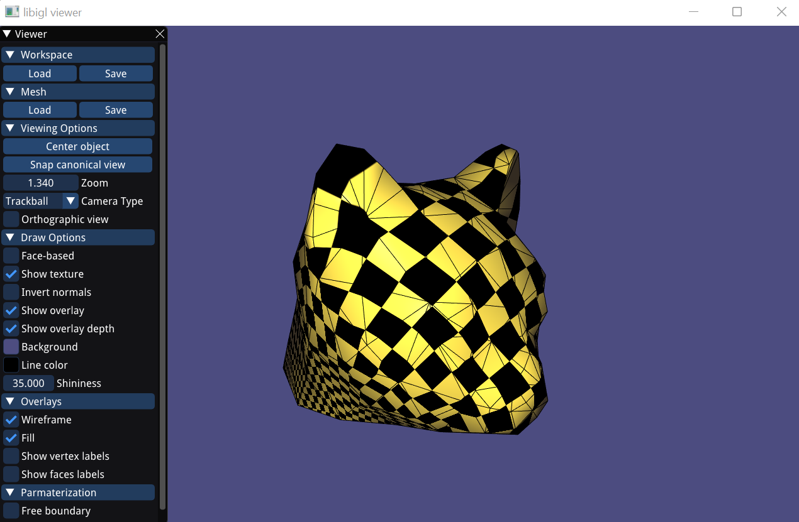

# Assignment 3

## Required results

* Screenshots of the parameterizations and textured (checkerboard) models for all the implemented methods and boundary conditions (models: cathead.obj, hemisphere.off, hemisphere_non_convex_boundary.off,Octo_cut2.obj)
  
---  
  

Shortcuts to the displayed models:
* [Cat](#Cat)
* [Hemisphere](#Hemisphere)
* [Cow](#Cow)
* [Max](#Max)
* [Bunny](#Bunny)
  
Cat
------------------------
### Tutte Parameterization
  
  
  

### Harmonic Parameterization
 
  
  
  
### LSCM Parameterization
Because the result of the LSCM parameterization without free boundary is the same as harmonic parameterization, it will not be displayed for the other models.  
  
  
  
  
  
### LSCM Parameterization with Free Boundary

      
  
  
[Return to Shortcuts](#models)    
  
---  
  
Hemisphere
------------------------
### Tutte Parameterization
  

### Harmonic Parameterization
  

### LSCM Parameterization with Free Boundary
 
  
[Return to Shortcuts](#models)    
  
---  
  
Cow
------------------------
### Tutte Parameterization
  

### Harmonic Parameterization
  

### LSCM Parameterization with Free Boundary
 
  
[Return to Shortcuts](#models)    
  
---  
  
Max
------------------------
### Tutte Parameterization
  

### Harmonic Parameterization
  

### LSCM Parameterization with Free Boundary
 
  
[Return to Shortcuts](#models)    
  
---  
  
Bunny
------------------------
### Tutte Parameterization
  

### Harmonic Parameterization
  

### LSCM Parameterization with Free Boundary
 
  
[Return to Shortcuts](#models)    
  
---    
  
* Several examples of the distortion visualizations.
  
---  
  

Shortcuts to distortion visualizations:
* [Tutte Parameterization](#Tutte)
* [Harmonic Parameterization](#Harmonic)
* [LSCM Parameterization](#LSCM)
  
Tutte Parameterization
------------------------
### Angle Preserving
 
  
### Length Preserving
 
  
### Area Preserving
 
  
[Return to Shortcuts](#distortions)    
  
Harmonic Parameterization
------------------------
### Angle Preserving
 
  
### Length Preserving
 
  
### Area Preserving
 
  
[Return to Shortcuts](#distortions)    
  
LSCM Parameterization with Free Boundary
------------------------
### Angle Preserving
 
  
### Length Preserving
 
  
### Area Preserving
 
  
[Return to Shortcuts](#distortions)    
  
