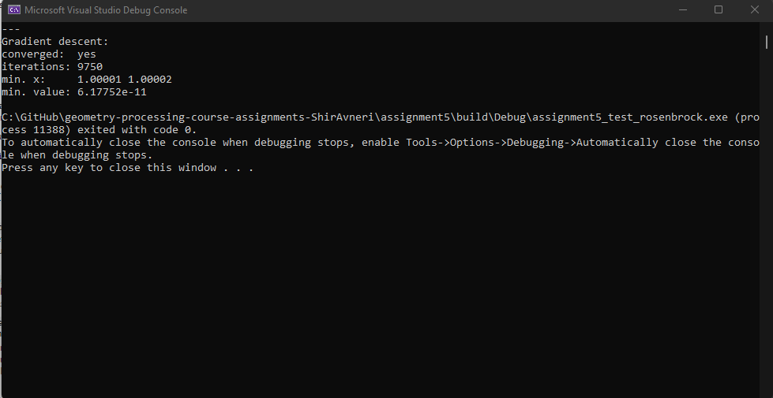
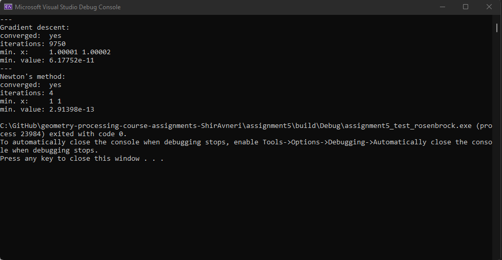
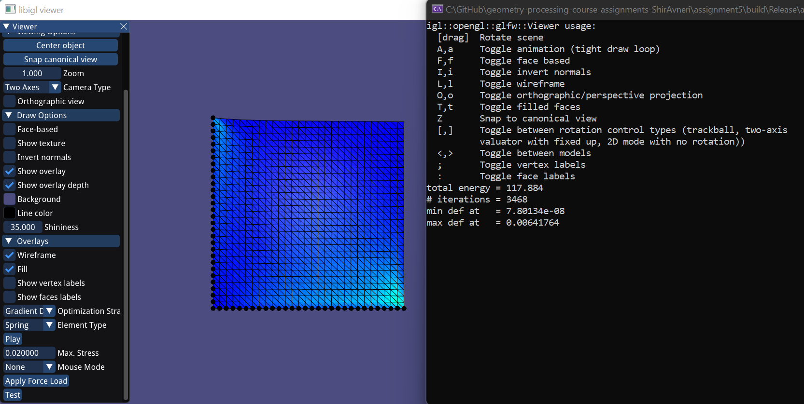
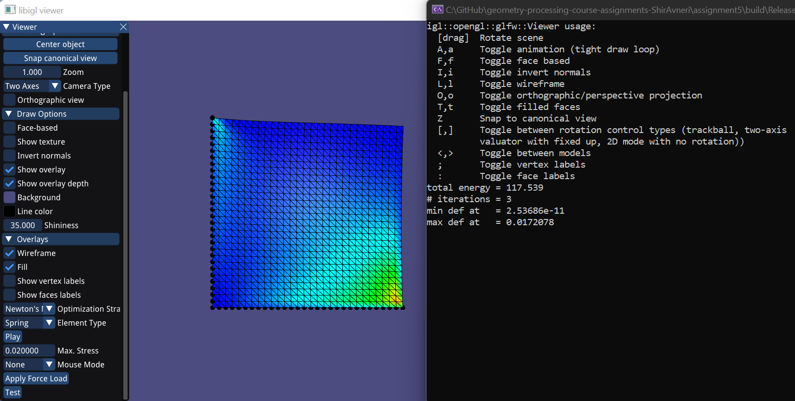

# Assignment 5

Edit this 'README.md' file to report all your results. There is no need to write lengthy reports, just show the requested outputs and screenshots and quickly summarize your observations.   

## Required results

### Optimization  

#### Gradient Descent and Line Search  
  

#### Newton's Method  
  

### Spring System Simulation

#### Spring Simulation with Gradient Descent  
  

#### Spring Simulation with Newton's Method  
  
